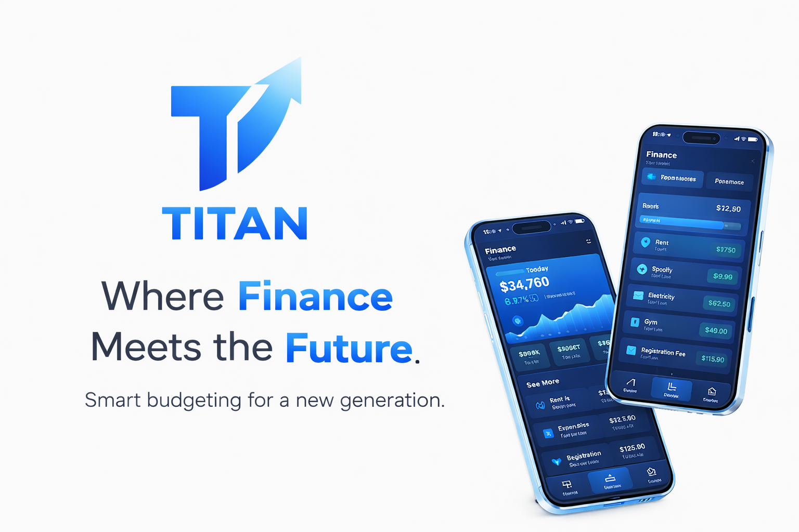

# Project Titan

Project Titan is a local-first finance and expense management web app focused on shared expenses, budgets, and settlement workflows.

The active product in this repository is the web client under `web/`, built with React + TypeScript + Vite and optimized for PWA usage.


## Preview



## Current Scope

- React 19 + TypeScript web app (Vite)
- Local-first state management via React Context + reducer
- IndexedDB persistence with offline queue scaffolding
- Expense tracking, groups, settlements, rent schedules, and insights
- PWA support with service worker caching

## Quick Start

### Prerequisites

- Node.js 20+
- npm 10+

### Install dependencies

```bash
npm --prefix web install
```

### Start development server

```bash
npm --prefix web run dev
```

### Build for production

```bash
npm --prefix web run build
```

### Preview production build

```bash
npm --prefix web run preview
```

## Useful Commands

```bash
# Run tests
npm --prefix web test

# Watch tests
npm --prefix web run test:watch

# Lint
npm --prefix web run lint

# Lighthouse CI
npm --prefix web run perf:lighthouse
```

## Environment Variables

Create `web/.env` when needed.

```bash
# Optional: enables Google Analytics
VITE_GA_MEASUREMENT_ID=G-XXXXXXXXXX

# Optional (dev): bypasses backend auth and derives username from email prefix
VITE_ENABLE_DEV_AUTH=true
```

If `VITE_GA_MEASUREMENT_ID` is not set, analytics remains disabled.

## Architecture Summary

```text
User action -> dispatch() -> reducer() -> state update -> IndexedDB persistence
```

- Central state is managed in `web/src/state/TitanStore.tsx`
- Financial math and formatting live in `web/src/lib/finance.ts`
- Backend adapter layer is in `web/src/services/titan-backend.ts`

## Deployment

- Production deployment uses Vercel (`vercel.json` at repository root)
- Static and PWA assets are served from `web/public/`

## Contributing

1. Create a branch (`feature/...`, `bugfix/...`, or `hotfix/...`)
2. Keep changes focused and well-scoped
3. Run lint/tests before opening a PR
4. Use conventional commits (example: `feat(budget): add monthly alert banner`)

## License

This project is licensed under the MIT License. See the `LICENSE` file for details.

## Community

- Open issues for bugs or ideas
- Propose feature specs with clear user outcomes
- Star the project if you want to support Titan's next release

Titan is designed to feel fast, calm, and practical every day.
