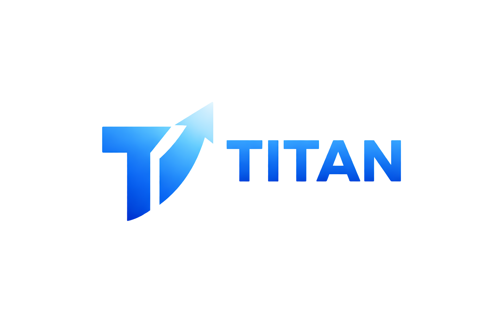
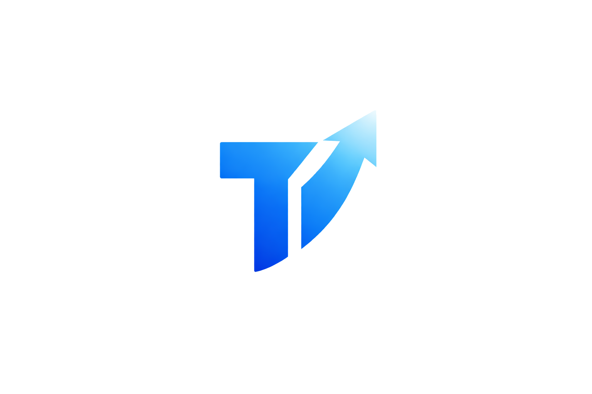

# Titan

### The app that organizes your life and rewards you for living it better

Titan is a Gen Z-focused super app built for people who want control without friction.

It combines finance, planning, habits, and rewards in one clean system so daily chaos turns into clear decisions.

---


---

## Preview


If Titan helps your workflow, drop a star on this repo.

---

## Why Titan?

### The problem

Most users juggle 5 to 8 different apps for money, reminders, tasks, and habits.
That fragmentation kills consistency.

### The solution

Titan unifies the daily operating system:

- Track spending and budgets
- Plan shared and personal payments
- Manage tasks and habits
- Stay motivated with rewards and streaks

### Why it is different

- **Minimal but powerful**: fewer screens, stronger outcomes
- **Logic-first**: practical rules before heavy AI
- **Gen Z India-first**: UPI, shared expenses, and mobile speed are core
- **Utility over noise**: no social clutter, just execution

---

## Features

### 💸 Finance

- Daily expense tracking
- Smart categorization
- Budget visibility and trend insights
- Can I afford this decision support

### 🤝 Social and Payments

- Split expenses with friends and groups
- UPI-oriented transaction review
- Shared group balances and settlement roadmap

### 🧠 Productivity

- Task management workflows
- Habit tracking loops
- Momentum-focused streak flow

### 🎮 Rewards

- Coins and streak signals
- Motivation loops tied to real actions
- Progress feedback to sustain consistency

---

## Tech Stack

### Product stack vision

**Frontend**

- React Native / Expo (mobile target)
- TypeScript

**Backend**

- Supabase
- Firebase

**Database**

- SQLite (offline-first data flow)

**AI**

- OpenAI API (minimal, assistive use only)

### Current repository implementation

This repository currently ships the web client with:

- React 19 + TypeScript
- Vite 8
- React Router
- IndexedDB + localStorage persistence
- PWA service worker caching
- Vercel deployment pipeline

---

## Architecture

```text
User Action
   ↓
Local State (React Context + Reducer)
   ↓
Offline Storage (IndexedDB / localStorage)
   ↓
Sync Layer (when enabled)
   ↓
Backend Services
   ↓
Insights + Recommendations + UI Feedback
```

Design principle: local-first responsiveness with sync as enhancement, not dependency.

---

## Screenshots

### Brand Preview



### App Icon



### Product Snapshot


---

## Getting Started

### Prerequisites

- Node.js 20+
- npm 10+

### Install

```bash
npm --prefix web install
```

### Run locally

```bash
npm --prefix web run dev
```

### Production build

```bash
npm --prefix web run build
```

### Preview production build

```bash
npm --prefix web run preview
```

### Environment setup

Create a file named `.env` inside `web/` if needed.

```bash
VITE_GA_MEASUREMENT_ID=G-XXXXXXXXXX
```

If the variable is missing, analytics stays disabled automatically.

---

## Roadmap

### V1 (in progress)

- Expense tracking and split workflow
- Budget and trend visibility
- UPI-oriented transaction review
- Group balances and settlement
- PWA support and offline behavior

### Upcoming

- Advanced AI spending insights (minimal and useful)
- Subscription and premium modules
- Stronger cohort-level retention analytics
- Deeper automation for habit + budget loops

---

## Contributing

Contributions are welcome.

### How to contribute

1. Fork the repo
2. Create a branch: `feature/your-change`
3. Commit cleanly: `feat(area): concise message`
4. Open a PR with context and screenshots

### Code style expectations

- Keep changes focused and small
- Prioritize readability over cleverness
- Preserve performance and accessibility
- Avoid introducing heavy dependencies without clear benefit

### PR checklist

- Build passes locally
- No obvious UX regressions
- Performance impact considered
- Description explains why, not just what

---

## Philosophy

Titan is built on three rules:

1. **Minimal but powerful**
2. **Offline-first by default**
3. **Utility over noise**

If a feature does not improve daily decisions, it does not ship.

---

## License

License is currently marked as **TBD** in this repository.

If you are the maintainer, add a `LICENSE` file (MIT recommended for open collaboration).

---

## Community

- Open issues for bugs or ideas
- Propose feature specs with clear user outcomes
- Star the project if you want to support Titan's next release

Titan is designed to feel fast, calm, and practical every day.
